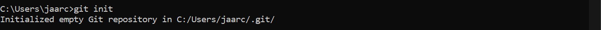
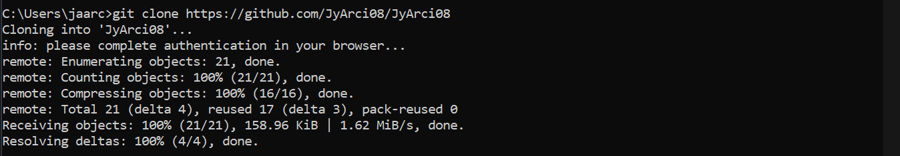
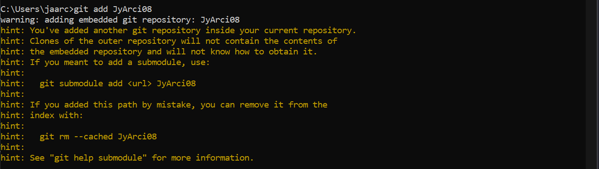
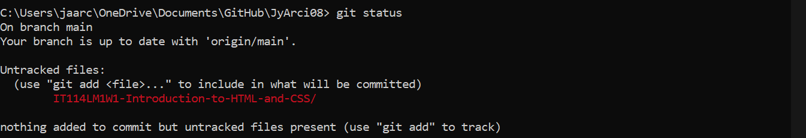

#                                          Olá, I'm Jyrel Arcillas 👋

## 📖 𝙰𝚋𝚘𝚞𝚝 𝙼𝚎
I'm currently a 2nd year college taking the course BSIT, and I'm still in the process of learning different aspects about programming. 

## 📫 𝙷𝚘𝚠 𝚝𝚘 𝚛𝚎𝚊𝚌𝚑 𝚖𝚎
  
ja.arcillas08@gmail.com

## 📝 Git Commands Cheat Sheet
➡️ Git Init  
📌 Create an empty Git repository or reinitialize an existing one  
🎲 Parameter: None  
✨ Example:  

➡️ Git Clone  
📌 Clone a repository into a new directory  
🎲 Parameter: [url]  
✨ Example:  

➡️ Git Add  
📌 Add file contents to the index  
🎲 Parameter: File name  
✨ Example:    

➡️ Git Status  
📌 Show the working tree status  
🎲 Parameter: None  
✨ Example:    

➡️ Git Commit  
📌 Record changes to the repository  
🎲 Parameter: -m "your commit message"  
✨ Example:    
