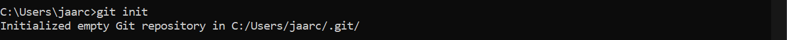
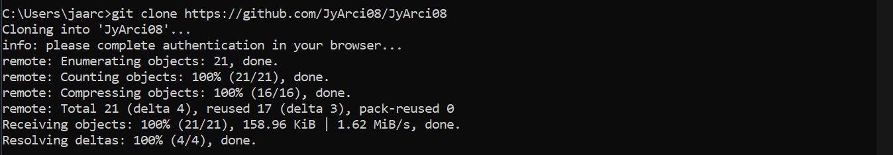
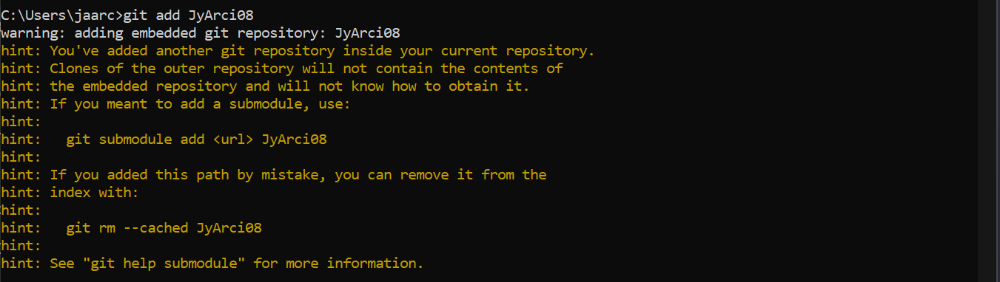
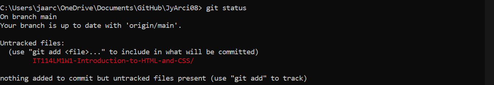
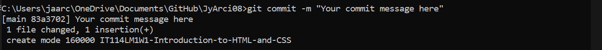
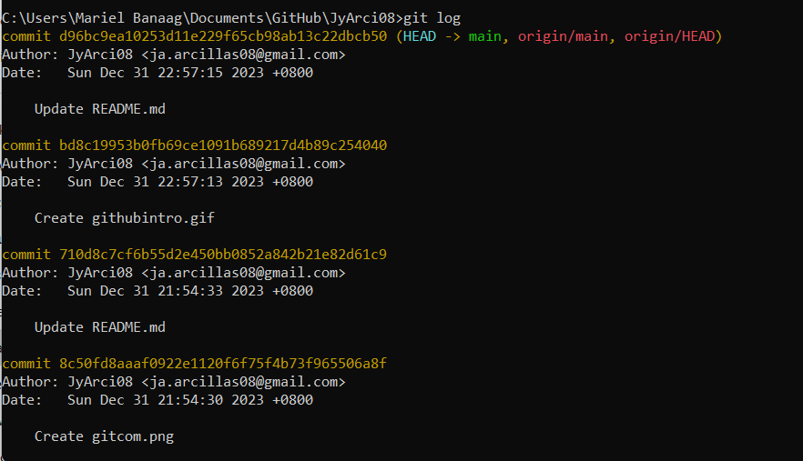
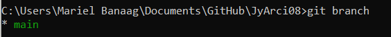

                                         Y'all can call me Jy!😁

## 📫 𝙷𝚘𝚠 𝚝𝚘 𝚛𝚎𝚊𝚌𝚑 𝚖𝚎
  
ja.arcillas08@gmail.com

## 📝 Git Commands Cheat Sheet
➡️ Git Init  
📌 Create an empty Git repository or reinitialize an existing one  
🎲 Parameter: None  
✨ Example:  

➡️ Git Clone  
📌 Clone a repository into a new directory  
🎲 Parameter: [url]  
✨ Example:  

➡️ Git Add  
📌 Add file contents to the index  
🎲 Parameter: File name  
✨ Example:    

➡️ Git Status  
📌 Show the working tree status  
🎲 Parameter: None  
✨ Example:    

➡️ Git Commit  
📌 Record changes to the repository  
🎲 Parameter: -m "your commit message"  
✨ Example:    

➡️ Git Log    
📌 Show the commit logs   
🎲 Parameter: None  
✨ Example:      
  

➡️ Git Branch     
📌 List, create, or delete branches    
🎲 Parameter: None    
✨ Example:        
    
